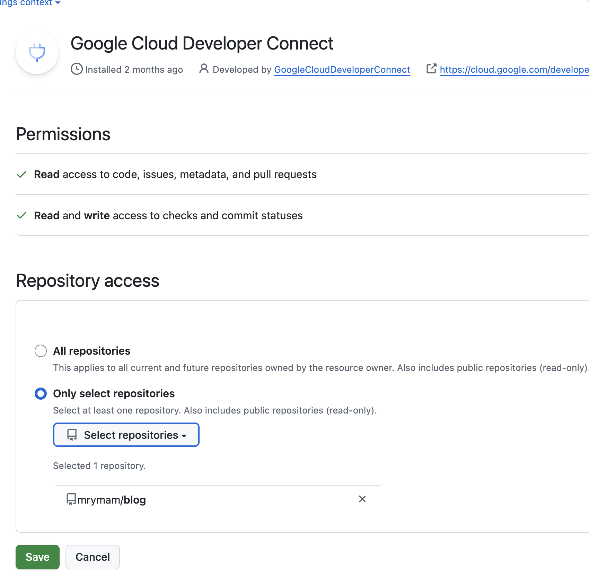

## 目次

---

## はじめに

セキュリティ的な意識が世の中で注視されているな思う昨今、GitHubもそこを意識した機能が続々と出ていますね。[ActionsのSHA pinningの強制](https://github.blog/changelog/2025-08-15-github-actions-policy-now-supports-blocking-and-sha-pinning-actions)や、[Immutable Release](https://github.blog/changelog/2025-08-26-releases-now-support-immutability-in-public-preview/) あたりは、結構うれしい機能で、みんなも早速使っている印象。

ただ、この辺の設定をOwnerがひとつずつ管理するのは難しいし、全てのリポジトリでガバナンスを効かせるのも難しいなと感じてきました。

できれば、IaC管理して、みんなでレビューできる体制にしたく、[GitHub の Terraform Provider](https://github.com/integrations/terraform-provider-github) で、やれそうか調べてみました

**この記事では**

この記事では、この辺を管理したら便利そうだなってところと、この辺は注意しないとなって思う部分をつらつらとまとめてみます。

できるだけ裏をとって調べていますが、間違っていたら指摘してください。

---

## 最初に結論

[Terraform Provider](https://github.com/integrations/terraform-provider-github)を調べてみた感じ、俺はTerraform管理したらいいなと思った。

ORG・Repository・GitHub Apps あたりの設定はTerraformで管理できると健全だなと思った。

- OwnerやAdminしか見れない設定を、チーム全員で見れるようになる
- PRレビューを通して合意形成・証跡管理ができる

ただし、最新機能への追従は遅れがち。手動管理との併用になる。

---

## 便利そうなユースケース

### 1. GitHub Actionsの設定

`Allow XXX org, and select non-XXX org, actions and reusable workflows` で、ホワイトリストで許可するアクションを指定する場合、メンバーに依頼をされて都度Ownerが設定することになる。ホワイトリストへの追加は、PRを出してくれてレビューをする形だと、証跡の管理にもなるし良い。
この辺のORGの設定は、ownerを持っていないとそもそも見えないところだから、どんな設定がされているかメンバーからもみれるってところもよい。

次の画像は、リポジトリレベルでの設定だけど、ORGレベルの設定だと、そもそもGitHub Actionsを許可するリポジトリの設定など、他にも都度設定する部分が出てくるので、嬉しいはず。

SHA Pinningの設定は、まだ対応されてないけど、ここもきっといつか対応してくれるはず。([Issue](https://github.com/integrations/terraform-provider-github/issues/2869)は立っている)

### 2. GitHub Appsのインストール

この設定は、Ownerしか見れない部分だから、やっぱりTerraform化して、レビューを通して入れたいところ。
リポジトリが増えるたびに対応が必要になる部分なので、手動管理コストも結構高いはず。

ただし、ここはClassic PATを使う必要があり注意。詳細は後述します。

### 3. チームの管理

- チーム自体の作成
- [チームのリポジトリへのロールのアタッチ](https://registry.terraform.io/providers/integrations/github/latest/docs/resources/team_repository)
- [チームのIdPとの同期接続](https://registry.terraform.io/providers/integrations/github/latest/docs/resources/team_sync_group_mapping)

個人的にはこのあたり管理が楽になるなって思う。

ただし、IdPのグループのIDとかはハードコードになるし、ownerに集中する作業ではないし、何か標準化したい部分も少ないから、そこまでって組織も多そう。

### 4. リポジトリの設定全般

ここは、レビューしたい、ownerに集中するのをやめたいってモチベーションよりも、設定を標準化したいって思う箇所かなと思う。

例えば、Repository Rulesetなどは、設定項目が結構多いから、全てのリポジトリを手動でガバナンス効かせるのか結構むずい。
だから、標準設定のモジュールを用意して、ガバナンスを効かせるみたいなのは、結構良いんじゃないかなと思う。

PullRequestがマージされたらブランチ消すやつ、よく設定漏れるけどそういうのも漏れずにできる。地味に嬉しい

### 5. Organization全体的な設定

Orgレベルの設定は、Owner以外が見れない箇所だから、Terraformで管理してチームで合意した設定にしたい。レビューされて設定されたという証跡も残る。

---

## 管理ができない・諦めた方がいいところ

### GitHub Appsの作成

上でGitHub AppsのインストールはTerraform管理できて嬉しいって書きましたが、
**Appsの管理自体**にはGitHub APIが対応しておらず、機能がサポートされていません。

[Issueコメント](https://github.com/integrations/terraform-provider-github/issues/509#issuecomment-1771169834)でも指摘されていますね
> This part of the API has existed for some time, it can be used to manage app installations, but not apps

### 新しい機能

後述しますが、新しい機能への追従は結構時間がかかっている印象です。
この辺は、機能追加されるまで手動管理をせざるを得ないなという感じです。

### 主要な未対応機能 抜粋

執筆時点で Terraform リソースが提供されていない機能です。

| 機能 | 備考 |
|------|------|
| GitHub App の作成 | App 自体の作成・設定は手動。インストール後のリポジトリ割当は `github_app_installation_repositories` で可 |
| Repository Rulesets の新機能 | 一部の新しいルールタイプが未対応の場合あり |
| GitHub Actions Shaping | 使用量制限・スペンディング制限の設定 |
| GitHub Copilot 設定 | 使用可能モデル、ポリシー設定など |

---

## 注意点

### 注意点1: Classic PATを使わないといけないところがある

GitHub Actions上で実行するとなると、Classic PAT、Fine-grained PAT、GitHub App Token の3種類が候補になりますが、基本的にはGitHub App Tokenで対応可能です。基本的にApp Tokenがセキュリティ的にもベストプラクティスだと思うので、これを使うことになると思います。

ただし、GitHub Appsのインストール（`github_app_installation_repositories`）は **Classic PAT** が必須となります。GitHub API

基本セキュリティ的な観点でこれを使いたくないってことが多いと思うので、悲しいところですね。

**参考**: [GitHub Docs - REST API endpoints for GitHub App installations](https://docs.github.com/en/rest/apps/installations#add-a-repository-to-an-app-installation)

### 注意点2: もちろん対応していない機能がある

#### GitHub Appsの作成

上でGitHub AppsのインストールはTerraform管理できて嬉しいって書きましたが、
**作成**はGitHub APIが対応しておらず、機能がサポートされていません。
ここは、結構Terraform管理したかったな。

https://github.com/integrations/terraform-provider-github/issues/509#issuecomment-909524982

#### 新しい機能

後述しますが、新しい機能への追従は結構時間がかかっている印象です。
この辺は、機能追加されるまで手動管理をせざるを得ないなという感じです。

#### 主要な未対応機能 抜粋

執筆時点で Terraform リソースが提供されていない機能です。

| 機能 | 備考 |
|------|------|
| GitHub App の作成 | App 自体の作成・設定は手動。インストール後のリポジトリ割当は `github_app_installation_repositories` で可 |
| Repository Rulesets の新機能 | 一部の新しいルールタイプが未対応の場合あり |
| GitHub Actions SHA Pinning | 使用量制限・スペンディング制限の設定 |
| GitHub Copilot 設定 | 使用可能モデル、ポリシー設定など |

## 機能追従が遅い問題を少し掘ってみる

**まず、GitHub Provider自体について**

GitHubのProviderは、公式で開発されているもので、Golangで開発されている。当たり前だけど、GitHub APIを後ろで叩いている（当たり前）。

**google/go-github 依存が大変そうだな**

github.com/google/go-github に依存して開発されているから、

github.com/google/go-github/v67/github

https://github.com/integrations/terraform-provider-github

https://registry.terraform.io/providers/integrations/github/latest

---

## まとめ

- 設定を標準化してガバナンスを効かせたい
- Ownerしか触れない箇所をIaC化して、チームの合意として設定を反映したい
  - チームメンバーがそもそも見れない箇所を見えるように
  - 証跡管理としたい
  - Ownerの作業負荷と責任をチームで持ちたい
- レビューを通して設定したい

この辺がモチベーションだなと感じました。

新機能のリリースまで時間がかかるっていうのはありますが、OSSにしてくれているんだから、使っている以上コントリビュートしないとでですね。

---

## おまけ：機能追従が遅い問題を少し掘って見る

GitHubのProviderは、公式で開発されているもので、当たり前だけど、GitHub APIを後ろで叩いている。そして、Goで開発されていて、github.com/google/go-githubという ライブラリ を使っています。

GitHub に新機能が追加されても、以下の順で対応されるので、普通に時間かかる。
これは、どのTerraform Providerも一緒そうですね。

1. GitHub API が対応
2. go-github が対応
3. Terraform Provider が SDK を更新
4. Provider 側でリソース実装

**go-github のアップデートがしんどそう**

さらに go-github は、メジャーバージョンアップ時の breaking change に結構苦労をしていそうです。

go-github v66 → v76 の間に 多数の breaking changeがあって、型定義の変更、API 削除、state migration あたりを頑張っている様子。

なので、go-github更新は メジャーリリース（v7.0.0）でまとめて行う。
→ 新しい go-githubがないと新しい機能のAPIを叩けないから、それに引っ張られて対応が遅る

という感じになっていそうです。

[[Milestone v7.0.0 Release]](https://github.com/integrations/terraform-provider-github/milestone/60) 
に SHA PinningのPull Request([[feat(actions_permissions): sha_pinning_required \#2870](https://github.com/integrations/terraform-provider-github/pull/2870#issuecomment-3603826427)] ) も載ってますね。

